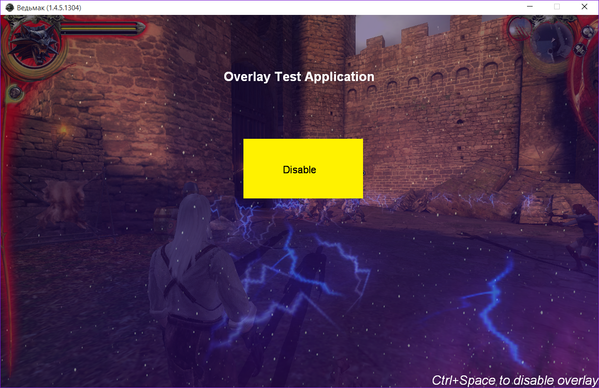

# Witcher Overlay

It's a simple Steam-like overlay for Witcher game made in the middle of 2015.

## Preface

I knew almost nothing about hooks and had no experience with DirectX. So I decided to find some open source library in order to solve this task.

**Dependency Walker** showed me that Witcher is made using DirectX 9. Among others (like for example [Mumble][mumble]) I've found a [DX9-Overlay-API][dx9-overlay] library which seemed to be fine for my particular case. It has LGPLv3 license which is acceptable as well.

Unfortunately this library was developed using an old version of [Microsoft Detours][detours] while the current version (3.0) has different API. So first I fixed the hooks in [DX9-Overlay-API][dx9-overlay].

Then I created a sample application using this library. The way it works is similar to the following:

- Main application starts and loads the DLL with API.
- Then Client is initialized: it injects the DLL into specified process and opens a named pipe for communication.
- DLL, injected into the target process, creates hooks for necessary functions, and begin to read commands from client (via pipe).

After I was able to draw some text over the game I started the development. Since I wanted to make an overlay with some state and interactivity I decided to put it completely into the DLL as the `Overlay` class.

[DX9-Overlay-API][dx9-overlay] has nothing about input handling in it. So I created more hooks. That was the most tricky part but with some help of [API Monitor][api-monitor] and a lot of spent time I finally was able to handle keyboard events and later also mouse events. The game uses Direct Input 8 which is deprecated right now, so I had to handle `WM_INPUT` messages as well (seems that DInput uses them internally). Also I hooked some other staff like `SetCursorPos` etc.

In order to pass the path where necessary images are located (from "injector"-application to the game) I use the pipe between client and server in [DX9-Overlay-API][dx9-overlay].

As a result I can't say that my code is perfect. Usually I don't use C-style casts, for example, and try to keep the coding style in consistency, while right now current version of the code mostly consists of an `Overlay` class and a bunch of small hacks distributed over the library internals. In "real-world" task what I would propose is to refactor all this code, migrate to [MinHook][minhook] instead of [Detours][detours] ('cause Detours is quite expensive for x64), etc. But maybe next time :)

## Meeting the requirements

- when application is started it tries to inject an overlay in "witcher.exe" and immediately terminates
- overlay is in **disabled** state by default
- press `Ctrl+Space` in order to enable/disable it
- while enabled all keyboard and mouse event are handled by the overlay
- resolution changes are handled automatically by the [DX9-Overlay-API][dx9-overlay] library: it has "native" resolution 800x600 and scales everything to the actual resolution

Tested on Windows 10.

## Known issues

- On some resolutions the text looks ugly (as if fonts are corrupted). Seems that it is an issue in library. Didn't have time to fix it.
- The button is not actually a button: it's just two images with separate text over it. So the layout is ugly as well.

## Build

In order to build the project you need:

- Visual Studio 2012 at least, I guess (I used 2013).
- [Microsoft Detours][detours] v3.0 (I suggest you to not build samples because there are some build issued on modern Visual Studio)
- [Boost][boost]
- DirectX SDK

[api-monitor]: http://www.rohitab.com/apimonitor
[boost]: http://www.boost.org
[detours]: http://research.microsoft.com/en-us/projects/detours/
[dx9-overlay]: https://github.com/agrippa1994/DX9-Overlay-API
[minhook]: https://github.com/TsudaKageyu/minhook
[mumble]: https://github.com/mumble-voip/mumble)
